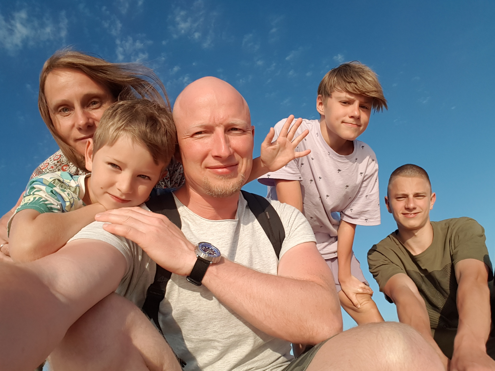
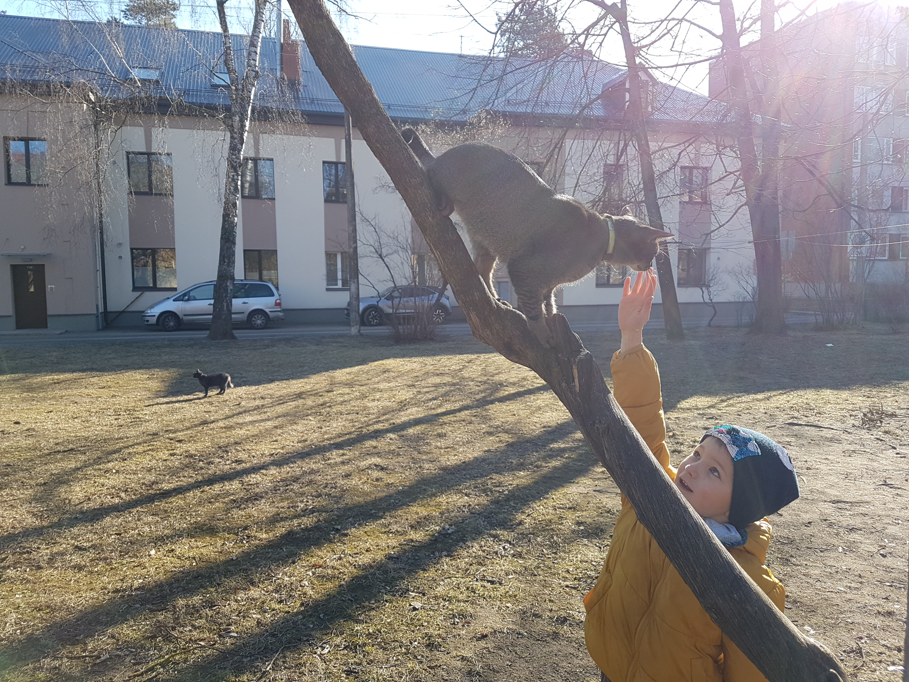

#          Īsumā par Gunu
 Rakstā ir izmantota produktu ievietošana! Nekas nav tā, kā izskatās :) 

## Ģimenes stāvoklis
    Stabils, nokomplektēts:
        - 20 gadi laulībā, vīrs, iespējams, [labākais kāzu fotogrāfs](http://www.rolfsvendins.lv/) :)
        - 3 dēli,
        - 2 kaķi.

## Nodarbošanās
    Nestabila, apnikusi, vēlams mainīt:
        - klīst runas par darbavietas likvidēšanu,
        - jau 13 gadi vienā darbavietā,
        - nav lietderīga sabiedrībai.

## Daži fakti, kas varētu būt interesanti
    1. piekopj mājdzemdības (wtf?),
    2. nelieto alko (tā, ka vispār nē, cilvēkiem reāli besī!),
    3. ziemā sēž āliņģī, 
    4. braucot tramvajā, lasa grāmatu vai ada zeķes,
    5. nelieto soctīklus,
    6. stulbākā rīcība - balsoja par Konservatīvajiem pagājušajās Saeimas vēlēšanās (dura)!
    7. no kļūdām mācās - par Konservatīvajiem vairs nebalsos, ir taču tik daudz citu iespēju stulbi nobalsot! :)

